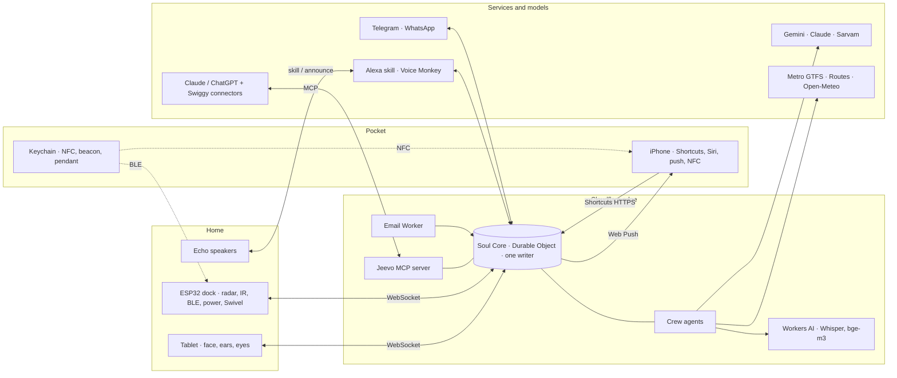

# Architecture

*How one soul runs on a tablet, an iPhone, a keychain, a dock and the cloud, with a crew of agents on many models.*

## The shape



Every device dials out (no port forwarding, no home server). The Soul Core is reachable from anywhere, so the iPhone works the same at home, on the metro, or in another city.

## 1. Soul Core

One Cloudflare Durable Object per soul, built with the Cloudflare Agents SDK.

- **Why a Durable Object:** it is single-threaded and strongly consistent, with its own SQLite database. One object = one soul = one writer. That removes the "two copies of Blue" problem GrowBot testers hit when two phones ran the same soul file.
- **What it stores:** the event log (append-only), facts (the Model of Me), lists, the ledger, reflexes, device registry, presence, schedules, budget meters, audit trail.
- **What it exposes:** WebSocket for presences; HTTPS endpoints for Shortcuts, the Alexa skill, Telegram/WhatsApp webhooks and the Email Worker; an MCP server (Streamable HTTP, OAuth) for AI apps.
- **Alarms:** Durable Object alarms run the 03:00 dream, reminders, the every-30-minute Chief of Staff check, and nightly backup.
- **Cost:** the Workers Free plan covers a personal soul (about 100k requests a day; SQLite storage isn't billed on Free). The $5/month paid plan only matters if parsing gets CPU-heavy.

### Event shape

```json
{ "id": "ev_01JB2…", "hlc": "2026-09-27T07:12:03.118Z/0003/tab",
  "device": "tab", "agent": "scribe", "kind": "heard",
  "who": "me", "text": "atta khatam ho gaya", "lang": "hi-IN",
  "tier": "P2", "refs": [] }
```

### Presence packet (devices → core, every change)

```json
{ "t": "presence", "device": "iph", "where": "metro", "attention": "pocket",
  "focus": "none", "battery": 0.62, "net": "cell",
  "caps": ["notify", "speak", "listen", "nfc-read"] }
```

### Intent (core → a device)

```json
{ "t": "intent", "to": "key", "do": "buzz", "pattern": "long-short",
  "reason": "leave_now", "trace": "tr_88c1" }
```

### Body messages (core → dock / walker)

The dock's Swivel and the walker speak GrowBot's body contract so the same code drives both: `hello`, `pose "l,r"`, `act [{l,r,ms}]`, `routine`, `stop`, each acknowledged before moving, with a dead-man stop after 500 ms of silence. The dock adds `ir`, `light`, `plug`, and reports `radar`, `ble`, `climate`, `heartbeat`.

## 2. Presences

A presence is any device connected to the soul. Each one announces what it can do (`caps`) and its current state. The core never assumes a device exists; it routes to what is connected right now.

| Presence | Connects by | Can do |
|---|---|---|
| Tablet web app | WebSocket | face, speak, listen, see, show |
| iPhone web app | WebSocket while open, Web Push when closed | notify, show, listen (in-app only) |
| iPhone Shortcuts | HTTPS per automation | location, SMS, Focus, NFC taps, Siri |
| Dock | WebSocket from the ESP32 | radar, IR, lights, plug, BLE scan, motor |
| Alexa | Custom skill (in), Voice Monkey (out) | speak, hear |
| AI apps | MCP | read and write memory, lists, today |
| Chat | Telegram / WhatsApp webhook | text and voice notes |

## 3. Ears (listening) and the lifelog

### Listening modes

| Mode | What it keeps | Ring light |
|---|---|---|
| Off | Nothing | Dark |
| On call | Only after wake phrase, tap or keychain button | Amber while listening |
| Ambient · me | Your own speech only (speaker check drops other voices before transcription) | Soft amber |
| Ambient · conversations | Both sides, labelled | Solid amber |
| Guest | Commands only, no memories | Blue |

### Pipeline (tablet)

1. Microphone → **Silero VAD** in the browser (ONNX): only speech frames continue.
2. **Sound events** in the browser (YAMNet plus a small classifier trained on your own clips): doorbell, knock, cooker whistle, water overflow.
3. **Language ID and route** (Scribe): English/Hindi → Whisper large-v3-turbo on Workers AI (about $0.03 an hour, and roughly 3.5 hours a day fit in the free allowance); Kannada or code-mixed → Sarvam Saaras or Gemini audio.
4. **Drop raw audio.** An optional 24-hour ring buffer on the tablet only, for "what did he just say?".
5. **Event** into the Soul Core with tier P2.

Android Chrome's built-in speech recognition (en-IN, hi-IN, kn-IN) is the zero-cost option for commands, but it sends audio to Google and stops on silence, so it suits "On call" mode, not ambient capture.

### What the lifelog holds

| Stream | Captured by | Tier | Kept |
|---|---|---|---|
| Speech at home | Tablet mic → Scribe | P2 | Transcript 90 days, summary forever |
| Speech outside | Pendant keychain or Siri | P2 | Same |
| Sounds | On-device classifier | P1 | Counts and times |
| Presence and rooms | Radar, beacon, home Wi-Fi | P1 | 90 days |
| Places | Shortcuts arrive/leave, NFC, car Bluetooth | P2 | Named places only |
| Money | Bank SMS (parsed on phone), statements | P2 | Forever |
| Orders and trips | Forwarded emails | P1 | Forever |
| Calendar | Google Calendar | P1 | Titles and times |
| Health | Apple Health summary | P2 | Daily numbers |
| Media | Spotify recently played; YouTube Takeout | P1 | Forever |
| AI chats | MCP `remember`, exports | P1–P2 | Reviewed facts |
| Photos | Share sheet only | P2 | Descriptions + link |
| Home climate | AHT20, Open-Meteo | P0 | 1 year |

### Privacy tiers

| Tier | Examples | Where it lives |
|---|---|---|
| P0 Open | Weather, timetables | Anywhere |
| P1 Personal | Lists, tasks, orders | Soul Core, encrypted at rest |
| P2 Sensitive | Transcripts, others' words, places, money, health | Soul Core; only model providers that don't train on API data; raw text expires |
| P3 Vault | ID numbers, medical records, anything you mark | Encrypted on your device with your passphrase; agents see it only while you unlock it |

Legal note (not legal advice): India's DPDP Act does not apply to processing "by an individual for any personal or domestic purpose" (section 3(c)(i)), which covers a personal lifelog. Recording guests and household staff is still an ethics question, so the defaults are: staff hours camera-off and no voice learning, guests told, "Ambient · me" as the everyday mode.

## 4. The crew

| Agent | Job | Models | Guardrail |
|---|---|---|---|
| Jeevo | The voice you talk to; delegates | Gemini 3.x Flash · Haiku 4.5 fallback | Can't pay, order or message without Guardian + you |
| Scribe | VAD, language ID, transcription routing, sound events | Silero, YAMNet on-device · Whisper on Workers AI · Sarvam / Gemini audio | Raw audio dropped |
| Librarian | Index, embeddings, recall with sources, forgetting | bge-m3 · Flash-Lite | Vault needs unlock |
| Dreamer | Nightly Day card, Model of Me proposals, patterns, reflexes; weekly review | Claude Sonnet 5 on Batch · Opus 5 or in-app weekly | Proposes, never confirms |
| Chief of Staff | Brief, promises, open loops, interrupt decisions | Flash-Lite checks · Sonnet 5 planning | 6 unrequested pings a day |
| Concierge | Metro, cabs, trips, Instamart lists, Dineout | Sonnet 5 · or inside the Claude app | Never calls Swiggy directly |
| Treasurer | Ledger, bills, splits, UPI links | Apple on-device model · 2.5 Flash-Lite | OTP firewall; never pays |
| Housekeeper | Presence, power, IR, lights, Swivel, cooker | Reflexes · Flash-Lite | Won't switch off if someone's home |
| Guardian | Consent, injection screening, approvals, budget, retention, audit | Rules · Haiku 4.5 / Flash-Lite | Can stop any agent |
| Scout | Research into the Lab archive | Claude with web search (in-app) | Dated sources |
| Coach | Kannada from your day, habits, diary | Gemini Flash · Bulbul v3 | No medical claims |

### How they cooperate

- **Blackboard:** all agents read and write the Soul event log; nothing happens off the log.
- **Conductor:** Jeevo runs live conversations and calls specialists as tools. Scheduled agents wake on alarms.
- **One writer:** agents are Durable Objects too, but they send proposals; the Soul Core orders and commits them.
- **Guardian in the path:** anything leaving the house (message, order, pay link, announcement) passes the Guardian and, above its threshold, your tap.
- **Budgets:** each agent has a daily token budget; the router downgrades models before it overspends.

## 5. Model router

| Task | First choice | Why | Fallback |
|---|---|---|---|
| Live conversation | Gemini 3.x Flash | Audio-native, fast, handles Hinglish | Haiku 4.5 |
| Should-I-interrupt, classify | Gemini 2.5 Flash-Lite | $0.10 / $0.40 per M tokens | Rules |
| English/Hindi transcription | Whisper large-v3-turbo (Workers AI) | ~$0.03/h, ~3.5 h/day free | Gemini audio |
| Kannada / code-mixed speech | Sarvam Saaras / Gemini audio | Whisper is weak here | Ask again |
| Voice out | Device TTS | Free | Sarvam Bulbul v3 |
| Nightly reflection | Claude Sonnet 5, Batch API | Judgment per rupee; batch is half price | Haiku 4.5 batch |
| Weekly review | Claude Opus 5, or in your Claude app | Deepest reasoning, weekly | Sonnet 5 |
| Tool-heavy errands | Claude Sonnet 5, or in-app | Reliable multi-step tool use | Gemini Flash |
| Seeing | MediaPipe on-device → Gemini Flash vision | Detect locally, describe rarely | Skip |
| Bank SMS | Apple on-device model in Shortcuts | SMS never leaves the phone | Regex |
| Embeddings | bge-m3 | Multilingual, $0.01 per M | Gemini embeddings |
| Vault | On-device only | By design | None |

Rules the router applies, in order: privacy tier first (P3 never leaves the device; P2 never goes to a provider that trains on API data, so no free tiers), then language, then latency need, then remaining budget. Gemini's Flash promo ($0.75 / $3.75) ends 31 Dec 2026; the Lab's budget tool has a 2027 toggle.

## 6. Model of Me

Twelve kinds of knowledge: people, places, routines, preferences, goals, promises, habits, health signals, money patterns, skills, media taste, languages.

Every fact carries `value`, `confidence`, `evidence` (event ids), `first_seen`, `last_seen`, `source` (told / observed / feedback), `tier`, and `status` (proposed / confirmed / rejected).

How it learns:

1. **Told.** "Remember that…" becomes a confirmed fact.
2. **Observed.** The Dreamer proposes facts; they wait in "Proposed" for the Sunday review.
3. **Feedback.** Each nudge records acted / ignored / snoozed. The attention router learns which surface and time work for each kind of message (a simple per-context bandit).
4. **Routines.** Recurring event times become routines with a normal range; drift triggers "running late?".
5. **Reflexes.** Repeated sequences become proposed reflexes that run with no model once approved (GrowBot's reflex tables, learned instead of written).
6. **Forgetting.** Facts decay unless seen again; you can delete anything.

## 7. Attention router

Inputs: where you are (home desk / home other room / commute / office / out), Focus (none / work / sleep / DND), phone state (in hand / pocket / charging at home), hour, guests present, message kind (urgency × privacy).

Rules, in order:

1. Sleep Focus or 23:00–06:00: hold everything below critical for the morning brief.
2. Guests present: nothing private is spoken aloud; private goes to the phone.
3. Work Focus: only high-urgency interrupts; the rest go to the digest.
4. At the desk: tablet voice + face. Elsewhere at home: the Echo in that room.
5. Away from home: phone notification; keychain haptic for time-critical things when the phone is in a pocket.
6. The daily interruption budget (6 unrequested) spills into the digest.
7. Everything is logged with its reason trace.

The Lab has a working sandbox of these rules.

## 8. Sync across devices

- Each device keeps a local cache (IndexedDB) and an outbox.
- Every event gets a **hybrid logical clock** stamp (wall time + counter + device).
- Online: events go straight to the Soul Core, which orders and commits them.
- Offline: events queue. On reconnect the core merges by HLC. Append-only events never conflict. Two different offline values for the same fact go to review instead of silently overwriting.
- Handoff: the conversation thread lives in the core, so it continues on whichever presence you pick up.
- Backup: nightly encrypted export to R2 (and optionally iCloud Drive). Restore on a new device by scanning a QR code.

The Lab has a two-device sync simulator.

## 9. Security

- Device tokens per presence, revocable from the Soul Inspector.
- The MCP server uses OAuth with per-tool scopes; write tools require confirmation.
- The OTP firewall runs on the iPhone before anything leaves it.
- Ingested email and web text is treated as data, never as instructions. The Guardian screens anything that would trigger an action.
- Spend caps per agent and per day; a hard stop at the monthly ceiling.
- Every action gets a reason trace: trigger, agent, model, evidence, approvals.
